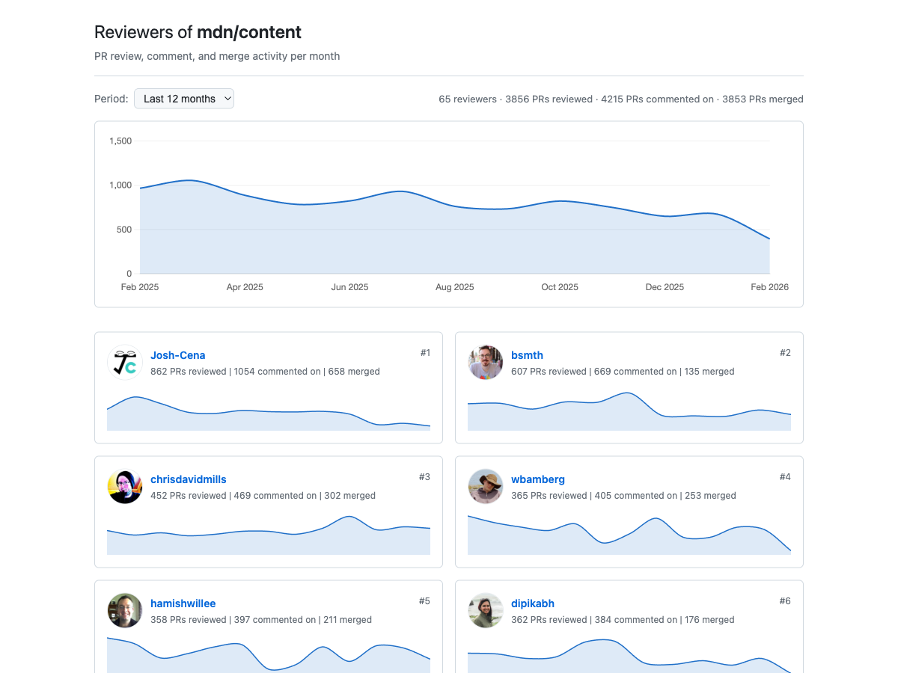

# gh-reviewers-graph

A GitHub CLI extension that generates a static HTML page showing PR reviewer activity for a GitHub repository. Produces a GitHub Contributors-style visualization with monthly review/comment/merge counts, sparkline charts, and time period filtering.



## Install

```bash
gh extension install gh-tui-tools/gh-reviewers-graph
```

Requires the [GitHub CLI](https://cli.github.com/) (`gh`) and Python 3.10+.

## Usage

```bash
gh reviewers-graph mdn/content
```

This discovers the top reviewers, fetches their monthly activity, and generates a static page at `./repos/mdn/content/index.html` (opened automatically).

### Options

| Flag | Default | Description |
|------|---------|-------------|
| `--output DIR` | `./repos` | Base reports directory |
| `--top N` | `100` | Number of top reviewers to include |
| `--refresh` | | Force re-fetch, ignoring cache |
| `--no-open` | | Don’t open the output in a browser |
| `--exclude LOGINS` | | Comma-separated logins to exclude (e.g., `bot1,bot2`) |

### Examples

```bash
# Generate page for a repository
gh reviewers-graph facebook/react

# Top 20 reviewers only
gh reviewers-graph facebook/react --top 20

# Force fresh data (ignore cache)
gh reviewers-graph mdn/content --refresh

# Custom base directory
gh reviewers-graph mdn/content --output ./reports

# Exclude specific accounts
gh reviewers-graph WebKit/WebKit --exclude webkit-commit-queue,webkit-early-warning-system
```

For examples, see [gh-tui-tools.github.io/gh-reviewers-graph](https://gh-tui-tools.github.io/gh-reviewers-graph/).

## What it shows

- **Overview chart** — combined reviewer activity over time (reviews + comments + merges)
- **Reviewer cards** — each reviewer’s avatar, total counts, and a per-reviewer sparkline
- **Period filter** — all time, last month, last 3/6/12/24 months
- **Three activity types** — PRs reviewed, PRs commented on, and PRs merged (excluding self-authored)

## How it works

1. **Discover reviewers** — scans up to 5,000 recent PRs to identify the most active reviewers and commenters
2. **Fetch monthly counts** — uses GitHub’s search API with batched GraphQL aliases (25 queries per request) for review and comment counts
3. **Fetch merge counts** — parallel date-range scanning to count merges per reviewer per month
4. **Cache and generate** — caches all data locally, then generates a self-contained static page

All API access goes through `gh api graphql`, so authentication is handled by your existing `gh` login — no tokens or environment variables needed.

## Performance

A typical run makes a few hundred API calls and finishes in under a minute. Repos with long histories and many reviewers (e.g., mdn/content: 66 months, 100 reviewers) take up to ~2 minutes and ~725 of the 5,000/hour GraphQL rate limit points. Subsequent runs use cached data and only re-fetch stale months.

Before expensive API work, the tool prints a budget summary showing estimated calls vs. remaining rate limit. If the limit is hit mid-run, a countdown timer shows time until reset.

## Development

```bash
# Run tests
python3 -m pytest tests/ -v

# Run directly (without gh extension install)
./gh-reviewers-graph mdn/content
```

## License

Apache 2.0
